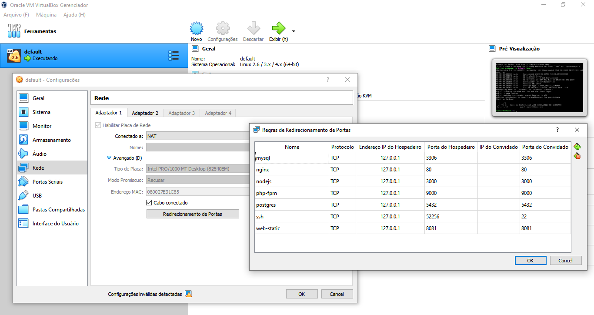

# Sysdomotic
* Docker
* Project building
* Timezone UTC (PHP, MySql, HTTPD, ... and OS)

## Documentation to create a development environment or production projects
 
To run the docker for this project, you need to follow the steps:
 
+ Install docker and docker-compose:
     * [For Mac](https://www.docker.com/docker-mac)
     * [For Windows](https://www.docker.com/docker-windows)
     * For Ubuntu `$ sudo apt-get install -y docker.io docker-compose`
     * You can add hosts and configs in the Virtualbox

         WINDOWS:
         

***

* To start the projects:

        $ sh start.sh <dir-company> <git-user-project> <dir-project-name> <project-version> <local or product>
        $ sudo chown -R $USER. <dir-company>/<dir-project-name>/<files*>
        $ vim <dir-company>/<dir-project-name>/.env

***

# Tradução
 
## Documentação para criar ambiente de desenvolvimento e produção dos projetos

Para executar o docker para este projeto, você precisa seguir as etapas:

+ Instalar docker e docker-compose:
     * [Para Mac](https://www.docker.com/docker-mac)
     * [Para Windows](https://www.docker.com/docker-windows)
     * Para Ubuntu $sudo apt-get install -y docker.io docker-compose
     * Adicione os hosts e configurações no Virtualbox

         WINDOWS:
         

***

* Para iniciar os projetos:

        $ sh start.sh <dir-company> <git-user-project> <dir-project-name> <project-version> <local or product>
        $ sudo chown -R $USER. <dir-company>/<dir-project-name>/<files*>
        $ vim <dir-company>/<dir-project-name>/.env

***