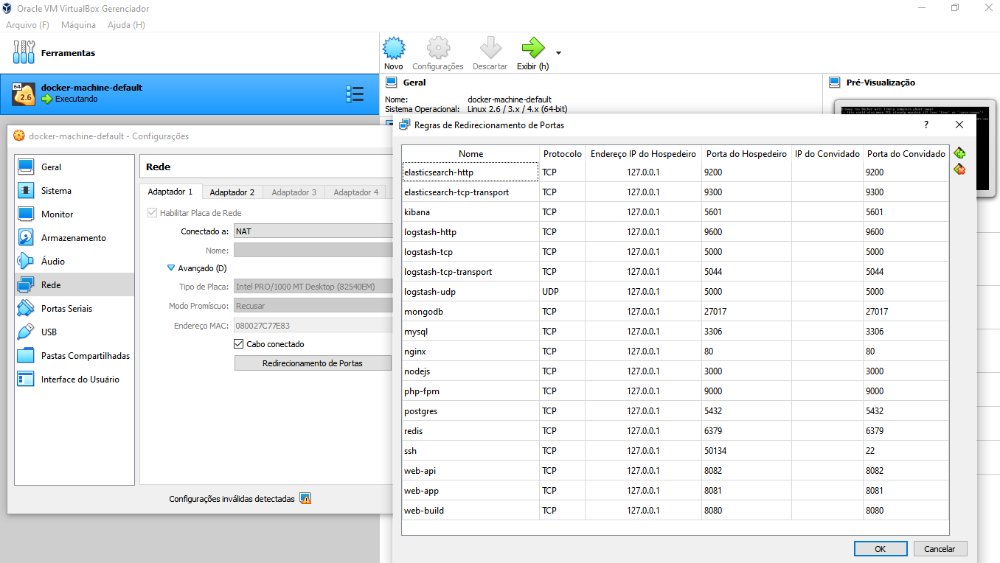

# Sysdomotic
* Docker
* Project building using docker-compose
* Containers (NGINX, PHP, NODEJS, MYSQL, POSTGRES, ... and OS)

## Introdução

Documentação criada para facilitar a infraestrutura de projetos DevOps da Sysdomotic. O repositório contém uma estrutura padrão para a criação de containers utilizando o [Docker](https://www.docker.com/get-started) e o [Docker Compose](https://docs.docker.com/compose/)

## Instalação

Para executar o docker para este projeto, você precisa seguir as etapas:

+ Instalar docker e docker-compose: ✔
     * [Para Mac](https://www.docker.com/docker-mac)
     * [Para Windows](https://www.docker.com/docker-windows)
     * Para Ubuntu ```bash $sudo apt-get install -y docker.io docker-compose```
     * Adicione os hosts e configurações no Virtualbox

         `WINDOWS`:
         

+ Configurações do GIT: ✔
     * [git submodule add](https://github.com/deviantony/docker-elk.git)
     * ```bash git config submodule.docker-elk.ignore all```
     * ```bash git config submodule.src/bundles/docker-elk.ignore all```

+ Pacotes do Elastic `ELK` no Docker: ✘ ☂
     * [deviantony/docker-elk](https://github.com/deviantony/docker-elk)
     * ~~Use single node discovery in order to disable production mode and avoid bootstrap checks~~
     * ~~Use o modo `SINGLE` para desativar o modo de produção e evitar verificações de inicialização~~
     * [Mais detalhes](https://www.elastic.co/guide/en/elasticsearch/reference/current/bootstrap-checks.html)

+ Scripts `SHELL` para facilitar: ✔
     * [docker-compose-run] ```bash docker-compose-run <option> <container or stack>```
     * [bin/start.sh] ```bash sh bin/start.sh```
     * [bin/exec.sh] ```bash sh bin/exec.sh```
     * [bin/build.sh] ```bash sh bin/build.sh```

## Modo de uso

```bash

docker-compose-run create nodejs reactjs mongodb

docker-compose-run down all

```

## Contribuições

Pull requests são bem vindos 😁✌. Para grandes mudanças, abra uma `ISSUE` primeiro para discutir o que você gostaria de mudar 😉.

Atualize os testes conforme apropriado e utilize o projeto conforme desejar.

Espero ter contribuído em algum momento no seu aprendizado. ¯\_( ͡• ͜ʖ ͡•)_/¯

## Licença
[MIT](https://choosealicense.com/licenses/mit/)